# Css Flex 가이드

## Flex란?

웹페이지의 레이아웃을 잡을 때 보통 display, float, position과 같은 css 속성들을 이용하는데, 이러한 속성들로 레이아웃을 구현하는 게 몹시 복잡하거나 어려울 때가 있다. 그 한계를 극복하기 위해서 css3에 flex라는 방식이 새롭게 추가되었다. flexible box, flexbox라고도 부르는 flex는 레이아웃 배치 기능에 중점을 맞추어 고안되었기 때문에 기본 방식보다 훨씬 더 수월하게 퍼블리싱이 가능하다.

- - -

## Flex 시작하기

Flex 레이아웃을 만들기 위한 기본적인 HTML 구조는 다음과 같다.

    

        
THE

        
FIFTY

        
ONE

    

부모 요소인 div.container를 Flex Container, 자식 요소인 div.item들을 Flex Item이라 부른다.
  
Flex의 속성들은,

- 컨테이너에 적용하는 속성
- 아이템에 적용하는 속성

두가지로 나뉜다.
먼저 컨테이너에 적용하는 속성들부터 알아보겠다.

- - -

## Flex 컨테이너에 적용하는 속성들

 

## **display: flex;**

flex 컨테이너에 display:flex;를 적용시켜준다.

    .container {
        display: flex;
    }

- display: flex 미적용 시

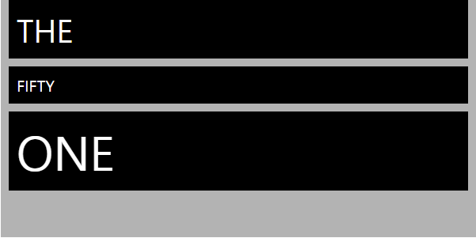

- display: flex 적용 시

Flex 아이템들은 가로 방향으로 배치되고, 자신이 가진 내용물의 width 만큼만 차지하게 된다. height는 컨테이너의 높이만큼 늘어난다.

- - -

## **배치 방향 설정 flex-direction**

아이템들이 배치되는 축의 방향을 결정하는 속성이다.

    .container {
        flex-direction: row;
        /* flex-direction: column; */
        /* flex-direction: row-reverse; */
        /* flex-direction: column-reverse; */
    }

- row (기본값) - 아이템들이 행(가로) 방향으로 배치된다.

- row-reverse - 아이템들이 역순으로 가로 배치된다.

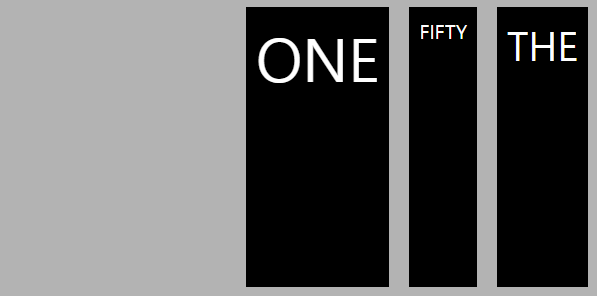

- column - 아이템들이 열(세로) 방향으로 배치된다.

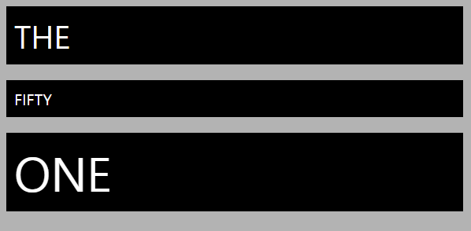

- column-reverse - 아이템들이 역순으로 세로 배치된다.

- - -

## **줄넘김 처리 설정 flex-wrap**

컨테이너가 더 이상 아이템들을 한 줄에 담을 여유 공간이 없을 때 아이템 줄바꿈을 어떻게 할지 결정하는 속성이다.

    .container {
        flex-wrap: nowrap;
        /* flex-wrap: wrap; */
        /* flex-wrap: wrap-reverse; */
    }

- nowrap (기본값) - 줄바꿈을 하지 않고 Container 밖으로 나간다.

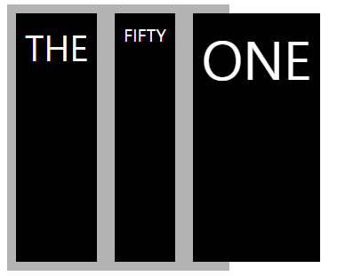

- wrap - 줄바꿈을 한다. float이나 inline-block으로 배치한 요소들과 비슷하게 동작한다.

- wrap-reverse - 줄바꿈을 하나 Item을 역순으로 배치한다.

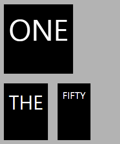

- - -

## **flex-flow**

flex-direction과 flex-wrap을 한꺼번에 지정할 수 있는 단축 속성이다.
flex-direction, flex-wrap의 순으로 한 칸 떼고 써주면 된다.

    .container {
        flex-flow: row wrap;
        /* 아래의 두 줄을 줄여 쓴 것 */
        /* flex-direction: row; */
        /* flex-wrap: wrap; */
    }

이제 정렬에 대해 알아보자.

- - -

## **메인축 방향 정렬 justify-content**

메인축 방향으로 아이템들을 정렬하는 속성이다.

    .container {
        justify-content: flex-start;
        /* justify-content: flex-end; */
        /* justify-content: center; */
        /* justify-content: space-between; */
        /* justify-content: space-around; */
        /* justify-content: space-evenly; */
    }

- flex-start (기본값) - 아이템들을 시작점으로 정렬한다. flex-direction이 row(가로 배치)일 때는 왼쪽, column(세로 배치)일 때는 위이다.

- flex-end - 아이템들을 끝점으로 정렬한다. flex-direction이 row(가로 배치)일 때는 오른쪽, column(세로 배치)일 때는 아래이다.

- center - 아이템들을 가운데로 정렬한다.

- space-between - 아이템들의 “사이(between)”에 균일한 간격을 만들어 준다.

- space-around - 아이템들의 “둘레(around)”에 균일한 간격을 만들어 준다.

- space-evenly - 아이템들의 사이와 양 끝에 균일한 간격을 만들어 준다.

- - -

## **수직축 방향 정렬 align-items**

수직축 방향으로 아이템을들 정렬하는 속성이다.

    .container {
        align-items: stretch;
        /* align-items: flex-start; */
        /* align-items: flex-end; */
        /* align-items: center; */
        /* align-items: baseline; */
    }

- stretch (기본값) - 아이템들이 수직축 방향으로 끝까지 늘어난다.

- flex-start - 아이템들을 시작점으로 정렬한다. flex-direction이 row(가로 배치)일 때는 위, column(세로 배치)일 때는 왼쪽이다.

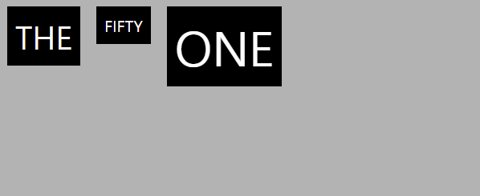

- flex-end - 아이템들을 끝으로 정렬한다. flex-direction이 row(가로 배치)일 때는 아래, column(세로 배치)일 때는 오른쪽이다.

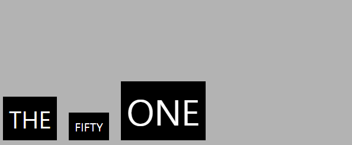

- center - 아이템들을 가운데로 정렬한다.

- baseline - 아이템들을 텍스트 베이스라인 기준으로 정렬한다.

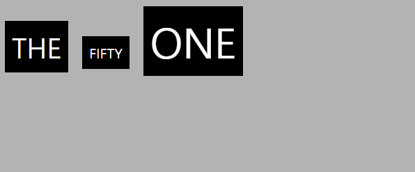

- - -

## **여러 행 정렬 align-content**

flex-wrap: wrap;이 설정된 상태에서, 아이템들의 행이 2줄 이상 되었을 때의 수직축 방향 정렬을 결정하는 속성이다.

    .container {
        flex-wrap: wrap;
        align-content: stretch;
        /* align-content: flex-start; */
        /* align-content: flex-end; */
        /* align-content: center; */
        /* align-content: space-between; */
        /* align-content: space-around; */
        /* align-content: space-evenly; */
    }

- stretch

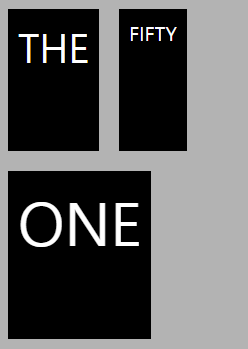

- flex-start

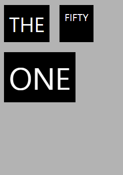

- flex-end

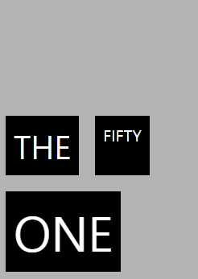

- center

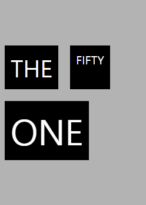

- space-between

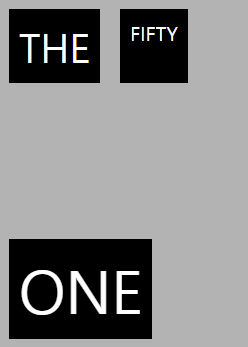

- space-around

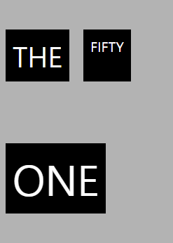

- space-evenly

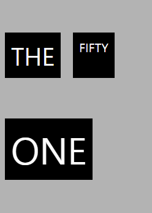

각 속성이 의미하는 바는 justify-content와 align-items에서 쓰인 의미와 중복된다.

- - -

## Flex 아이템에 적용하는 속성들

## **유연한 박스의 기본 영역 flex-basis**

flex-basis는 Flex 아이템의 기본 크기를 설정한다. (flex-direction이 row일 때는 너비, column일 때는 높이).

    .item {
        flex-basis: auto; /* 기본값 */
        /* flex-basis: 0; */
        /* flex-basis: 50%; */
        /* flex-basis: 300px; */
        /* flex-basis: 10rem; */
        /* flex-basis: content; */
    }

flex-basis의 값으로는 우리가 width, height 등에 사용하는 각종 단위의 수가 들어갈 수 있고, 기본값 auto는 해당 아이템의 width값을 사용한다.

- - -

## **유연하게 늘리기 flex-grow**

flex-grow는 아이템이 flex-basis의 값보다 커질 수 있는지를 결정하는 속성이다.
flex-grow에는 숫자값이 들어가는데, 몇이든 일단 0보다 큰 값이 세팅이 되면 해당 아이템이 유연한(Flexible) 박스로 변하고 원래의 크기보다 커지며 빈 공간을 메우게 된다.
기본값이 0이기 때문에, 따로 적용하기 전까지는 아이템이 늘어나지 않는다.

- flex-grow에 0을 세팅한 경우

- flex-grow에 1을 세팅한 경우

flex-grow에 들어가는 숫자의 의미는, 아이템들의 flex-basis를 제외한 여백 부분을 flex-grow에 지정된 숫자의 비율로 나누어 가진다.

예제를 살펴보자.

    /* 1:2:1의 비율로 세팅할 경우 */
    .item:nth-child(1) { flex-grow: 1; }
    .item:nth-child(2) { flex-grow: 2; }
    .item:nth-child(3) { flex-grow: 1; }

각 아이템의 컨텐츠가 “THE”, “FIFTY”, “ONE”으로 원래의 크기가 다르기 때문에 전체 아이템의 크기가 살짝 애매한 비율로 보이지만, 여백의 비로 생각해 보면 정확히 1:2:1이다.

- - -

## **유연하게 줄이기 flex-shrink**

flex-shrink는 flex-grow와 쌍을 이루는 속성으로, 아이템이 flex-basis의 값보다 작아질 수 있는지를 결정한다.
flex-shrink에는 숫자값이 들어가는데, 몇이든 일단 0보다 큰 값이 세팅이 되면 해당 아이템이 유연한(Flexible) 박스로 변하고 flex-basis보다 작아진다.
기본값이 1이기 때문에 따로 세팅하지 않아도 아이템이 flex-basis보다 작아질 수 있다.

    .item {
        flex-basis: 150px;
        flex-shrink: 1; /* 기본값 */
    }

flex-shrink를 0으로 세팅하면 아이템의 크기가 flex-basis보다 작아지지 않기 때문에 고정폭의 컬럼을 쉽게 만들 수 있다. 고정 크기는 width로 설정한다. 예제를 확인해보자.

    .item:nth-child(1) {
        flex-shrink: 0;
        width: 80px;
    }
    .item:nth-child(2) {
        flex-shrink: 0;
        width: 80px;
    }
    .item:nth-child(3) {
        flex-grow: 1;
    }

flex-shrink: 0; 덕분에 컨테이너가 아무리 작아져도 첫번째, 두번째 아이템은 찌그러지지 않고 폭이 80px로 유지된다.

- - -

## **flex**

flex-grow, flex-shrink, flex-basis를 한 번에 쓸 수 있는 축약형 속성이다.
이 세 속성들은 서로 관련이 깊기 때문에, 이 축약형을 쓰는 편이 여러모로 편리하다.

    .item {
        flex: 1;
        /* flex-grow: 1; flex-shrink: 1; flex-basis: 0%; */
        flex: 1 1 auto;
        /* flex-grow: 1; flex-shrink: 1; flex-basis: auto; */
        flex: 1 500px;
        /* flex-grow: 1; flex-shrink: 1; flex-basis: 500px; */
    }

주의할 점은, flex: 1; 이런 식으로 flex-basis를 생략해서 쓰면 flex-basis의 값은 0이 된다.

축약형 flex로 예시를 들어보자.

    .item {
        flex: 1 1 0;
    }
    .item:nth-child(2) {
        flex: 2 1 0;
    }

flex-basis: 0; 으로, 기본 점유 크기를 0으로 만들어버려 결국 전체 크기를 1:2:1로 나누어 가져서, 영역 자체의 크기가 정확히 1:2:1의 비율로 설정되었다.
여백의 비가 아닌, 영역 자체를 원하는 비율로 분할하기를 원한다면 flex-basis을 0으로 함으로써 손쉽게 처리할 수 있다.

- - -

## **수직축으로 아이템 정렬 align-self**

align-items의 아이템 버전. align-items가 전체 아이템의 수직축 방향 정렬이라면, align-self는 해당 아이템의 수직축 방향 정렬이다.

    .item {
        align-self: auto;
        /* align-self: stretch; */
        /* align-self: flex-start; */
        /* align-self: flex-end; */
        /* align-self: center; */
        /* align-self: baseline; */
    }

기본값은 auto로, 기본적으로 align-items 설정을 상속 받고,
align-self는 align-items보다 우선권이 있다.
auto외의 나머지 값들은 align-items와 동일하다.

    .item:nth-child(1){align-self: auto;}
    .item:nth-child(2){align-self: stretch;}
    .item:nth-child(3){align-self: flex-start;}
    .item:nth-child(4){align-self: flex-end;}
    .item:nth-child(5){align-self: center;}
    .item:nth-child(6){align-self: baseline;}

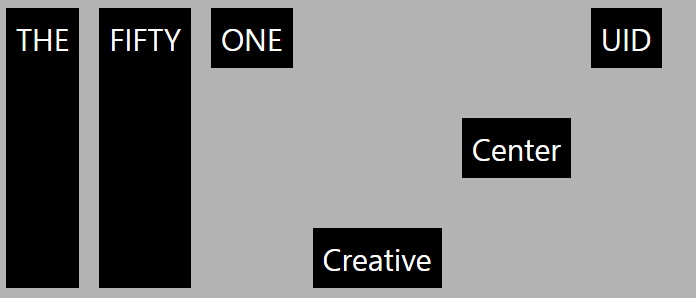

- - -

## **배치 순서 order**

각 아이템들의 시각적 나열 순서를 결정하는 속성이다. 숫자값이 들어가며, 작은 숫자일 수록 먼저 배치된다. “시각적” 순서일 뿐, HTML 자체의 구조를 바꾸는 것은 아니므로 접근성 측면에서 사용에 주의해야 한다.

    .item:nth-child(1) { order: 3; } /* A */
    .item:nth-child(2) { order: 1; } /* B */
    .item:nth-child(3) { order: 2; } /* C */

- - -

## **z-index**

z-index로 Z축 정렬을 할 수 있고, 숫자가 클 수록 위로 올라온다. (position에서의 z-index랑 똑같이 생각하면 된다.)

    .item:nth-child(2) {
        z-index: 1;
        transform: scale(2);
    }
    /* z-index를 설정 안하면 0이므로, 1만 설정해도 나머지 아이템을 보다 위로 올라온다 */

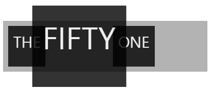